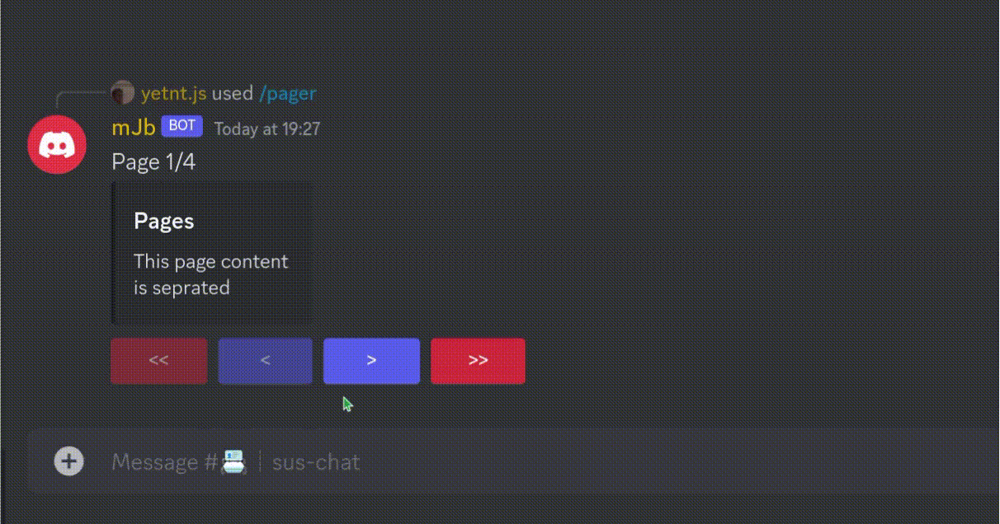

# dpager

Discord.js Pager

# Install

```sh
npm i dpager
yarn add dpager
```

# Use

```js
const { Pager } = require("dpager");
```

```ts
import { Pager } from "dpager";
```

# Pager

Class that defines the page handler.

## Constructor

-   `title` **(optional)**: Default title to use for pages that do not have it's own title

```js
const { Pager } = require("dpager");

const pages = new Pager("shop");
```

## Methods

### `addPage`

Add a singular page.

-   `T` : Content of the page (string)
-   `T` _**(overload)**_ : Content, title and others for the page's embed (object)

```js
const pages = new Pager();

pages.addPage("what's up"); // add page a from string
pages.addPage({
    title: "Page title",
    content: "Page content",
}); // add a page from an object
```

### `addPages`

Add multiple pages at once

-   `...T`: Content of the page (string)
-   `...T` _**(overload)**_ : Content, title and others for the page's embed (object)

```js
const pages = new Pager();

pages.addPages("what's up", "my name's ko!"); // add page a from string
pages.addPages(
    {
        title: "Page title",
        content: "Page content",
    },
    {
        title: "goofy",
        content: "mhm",
    }
); // add a page from an object
```

### `removePage`

Remove one page by it's index

-   `index`: Page index (0-indexed, so page 1 is 0)

```js
pages.removePage(1); // removes page 2
```

### `addDynamicPages`

Dynamically pages from an array of strings

-   `array`: Array of strings
-   `maxContentperPage`: Amount of content on a page before it goes to the next page
-   `seprator`**(optional)**: Seprator to seprate content on one page

```js
pages.addDynamicPages(["hi", "im", "dy", "namic!", "cool?"], 2, "\n"); // separator defaults to a line break. I just addedd for example's sake

// equavalent to

pages.addPages("hi\nim", "dy\nnamic!", "cool?");
```

### `config`

Change the buttons. (You cannot edit the customIds and it's recommended you don't or else this won't work)

-   `i`: Object of new buttons (Should look something like this):

```js
const {ButtonStyle} = require("discord.js")

let buttons = {
    nextPage: {}, // button to go over to the next page
    prevPage: {}, //  button to go to the previous page
    prevMaxPage: {}, // button to skip to the first page
    nextMaxPage: {} // button to skip to the last page
}

// and those objects can accept these following parameters:

{
    label: "Button label",
    style: ButtonStyle.Success,
    emoji: "Button emoji"
}

pages.config(i)
```

### `currentPage`

Returns an object with the current page's embed, components and raw contents if you do not want it's embed

-   `customId` **(optional)**: When given the customId, it will go to the page based on the id (So if you pass `"nextPage"` into it, It will change the index and return the object for the next page. and etc)

```js
pages.currentPage(); // on page 1, returns page 1 contents
pages.currentPage("nextPage"); // on page 2 now, returns page 2 contents
pages.currentPage(); // still on page 2
pages.currentPage("prevPage"); // back on page 1, returns it's contents now
```

#### _returns_

```js
{
    embed: // instance of EmbedBuilder that you can add to an interaction.reply/update,
    components: // array of components that contains the required buttons
    raw: {
        title: // page's title if given. If not, is undefined
        content: // page's content.
    }
}
```

## Properties

### _pages_

Array of the pages.

```js
pages.pages;
```

### _index_

Current page index. (0-indexed)

```js
pages.index;
```

# Example

```js
const { Pager } = require("dpager");
const { ComponentType, ButtonStyle } = require("discord.js");

// place this code either in an "interactionCreate" event or any slash command event that takes interaction as a parameter

const pager = new Pager();

pager.addDynamicPages(
    [
        "This page content",
        "is seprated",
        "wow",
        "isnt that cool?",
        "no",
        "it's not cool :pensive:",
        "Yes you nerd.",
    ],
    2
);

// We don't define the labels, so the default labels (arrows) are used.
pager.config({
    nextPage: {
        style: ButtonStyle.Primary,
    },
    prevPage: {
        style: ButtonStyle.Primary,
    },
    nextMaxPage: {
        style: ButtonStyle.Danger,
    },
    prevMaxPage: {
        style: ButtonStyle.Danger,
    },
});

let initPage = await pager.currentPage();
let index = `Page ${pager.index + 1}/${pager.pages.length}`;

await interaction.reply({
    content: index,
    embeds: [initPage.embed],
    components: initPage.components,
});

const reply = await interaction.fetchReply();

const collector = reply.createMessageComponentCollector({
    componentType: ComponentType.Button,
    time: 15_000,
});

collector.on("collect", async (i) => {
    let page = await pager.currentPage(i.customId);
    let index = `Page ${pager.index + 1}/${pager.pages.length}`;
    i.update({
        content: index,
        embeds: [page.embed],
        components: page.components,
    });
});
```

_Do not mind my chromebook's bad quality_

